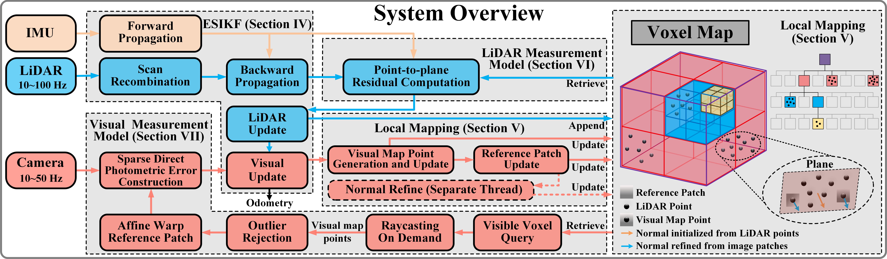

# RT-LIVO

## RT-LIVO: Real-Time LiDAR-Inertial-Visual Odometry with Dynamic Object Removal

**A modified version of FAST-LIVO2 with RT-DETR integration for real-time dynamic object detection and removal.**

### 📢 News

- 🚀 **2026-06-24**: Motion-verifier based dynamic object removal pipeline + M3DGR dataset support.
- 🔓 **2025-01-23**: Code released!
- 🎉 **2024-10-01**: FAST-LIVO2 accepted by **T-RO '24**!

### 📬 Contact

- **Original FAST-LIVO2**: [zhengcr@connect.hku.hk](mailto:zhengcr@connect.hku.hk)
- **RT-LIVO Modifications**: Based on FAST-LIVO2 with RT-DETR integration

## 1. Introduction

RT-LIVO is built upon FAST-LIVO2, an efficient and accurate LiDAR-inertial-visual fusion localization and mapping system. This version adds real-time dynamic object detection capabilities using RT-DETR, enabling the system to detect and remove dynamic objects (e.g., people, vehicles) from the point cloud map.

**Original Developer**: [Chunran Zheng 郑纯然](https://github.com/xuankuzcr)

<div align="center">
    
</div>

### 1.1 Related video

Our accompanying video is now available on [**Bilibili**](https://www.bilibili.com/video/BV1Ezxge7EEi) and [**YouTube**](https://youtu.be/6dF2DzgbtlY).

### 1.2 Related paper

[FAST-LIVO2: Fast, Direct LiDAR-Inertial-Visual Odometry](https://arxiv.org/pdf/2408.14035)  

[FAST-LIVO2 on Resource-Constrained Platforms](https://arxiv.org/pdf/2501.13876)  

[FAST-LIVO: Fast and Tightly-coupled Sparse-Direct LiDAR-Inertial-Visual Odometry](https://arxiv.org/pdf/2203.00893)

[FAST-Calib: LiDAR-Camera Extrinsic Calibration in One Second](https://www.arxiv.org/pdf/2507.17210)

### 1.3 Our hard-synchronized equipment

We open-source our handheld device, including CAD files, synchronization scheme, STM32 source code, wiring instructions, and sensor ROS driver. Access these resources at this repository: [**LIV_handhold**](https://github.com/xuankuzcr/LIV_handhold).

### 1.4 Our associate dataset: FAST-LIVO2-Dataset
Our associate dataset [**FAST-LIVO2-Dataset**](https://connecthkuhk-my.sharepoint.com/:f:/g/personal/zhengcr_connect_hku_hk/ErdFNQtjMxZOorYKDTtK4ugBkogXfq1OfDm90GECouuIQA?e=KngY9Z) used for evaluation is also available online.

### 1.5 Our LiDAR-camera calibration method
The [**FAST-Calib**](https://github.com/hku-mars/FAST-Calib) toolkit is recommended. Its output extrinsic parameters can be directly filled into the YAML file.

### 1.6 RT-DETR Integration

This version integrates RT-DETR (Real-Time Detection Transformer) for dynamic object detection and removal:

- **Model**: RT-DETRv2 ONNX model (placed in `weights/`), accelerated via ONNX Runtime with CUDA.
- **Configuration**: see the `rtdetr:` block in `config/avia.yaml` or `config/m3dgr_mid360.yaml`.

#### Removal pipeline

Detection results are treated only as *semantic dynamic candidates*. Every candidate passes through a multi-stage pipeline before any point is deleted:

1. **RT-DETR detection** — bounding boxes + confidence from camera images.
2. **Tiered class prior** — each COCO class is assigned a motion prior:
   - `HIGH` — people / animals (`person` + `bird..giraffe`, 11 classes) → removed directly.
   - `MEDIUM` — vehicles (`bicycle/car/motorcycle/airplane/bus/train/truck/boat`, 8 classes) → verified by optical flow, removed only if moving.
   - `LOW` — everything else (61 classes) → kept.
3. **Optical-flow motion verification** — ROI vs. background flow median; too few trackable corners → `UNCERTAIN` (kept).
4. **Depth gating** — a point is removed only if it falls inside a box *and* its depth matches the object.
5. **Temporal smoothing** — cross-frame IoU association + `MOVING` state hold suppress single-frame flicker.
6. **Adaptive padding** — box expansion driven by depth / time-delay / motion score.
7. **Reliability-aware visual covariance** — down-weights the visual constraint when dynamic regions dominate.

Setting `rtdetr/enable: false` disables the whole pipeline and the system falls back to plain FAST-LIVO2.

**Note**: proper LiDAR-camera extrinsic calibration (`Rcl`/`Pcl`) is critical for accurate point projection. Use [FAST-Calib](https://github.com/hku-mars/FAST-Calib) or similar tools.

## 2. Prerequisites

### 2.1 Ubuntu and ROS

Ubuntu 18.04~20.04.  [ROS Installation](http://wiki.ros.org/ROS/Installation).

### 2.2 PCL && Eigen && OpenCV

PCL>=1.8, Follow [PCL Installation](https://pointclouds.org/). 

Eigen>=3.3.4, Follow [Eigen Installation](https://eigen.tuxfamily.org/index.php?title=Main_Page).

OpenCV>=4.2, Follow [Opencv Installation](http://opencv.org/).

### 2.3 ONNX Runtime

Required for RT-DETR inference. Download and install ONNX Runtime:

```bash
# For GPU support (recommended)
wget https://github.com/microsoft/onnxruntime/releases/download/v1.23.2/onnxruntime-linux-x64-gpu-1.23.2.tgz
tar -xzf onnxruntime-linux-x64-gpu-1.23.2.tgz
sudo mv onnxruntime-linux-x64-gpu-1.23.2 /opt/onnxruntime

# For CPU only
# wget https://github.com/microsoft/onnxruntime/releases/download/v1.23.2/onnxruntime-linux-x64-1.23.2.tgz
```

**Important**: Update the `ONNXRUNTIME_DIR` path in `CMakeLists.txt` to match your installation location.

### 2.4 Sophus

Sophus Installation for the non-templated/double-only version.

```bash
git clone https://github.com/strasdat/Sophus.git
cd Sophus
git checkout a621ff
mkdir build && cd build && cmake ..
make
sudo make install
```

### 2.5 Vikit

Vikit contains camera models, some math and interpolation functions that we need. Vikit is a catkin project, therefore, download it into your catkin workspace source folder.

```bash
# Different from the one used in fast-livo1
cd catkin_ws/src
git clone https://github.com/xuankuzcr/rpg_vikit.git 
```

## 3. Build

Clone the repository and catkin_make:

```
cd ~/catkin_ws/src
git clone https://github.com/hku-mars/FAST-LIVO2.git rt_livo
cd ../
catkin_make
source ~/catkin_ws/devel/setup.bash
```

**Note**: This repository is named `rt_livo` to distinguish it from the original FAST-LIVO2.

## 4. Run our examples

### 4.1 Prepare RT-DETR Model

Download RT-DETR ONNX model and place it in the `weights/` directory:

```bash
cd ~/catkin_ws/src/rt_livo
mkdir -p weights
# Download RT-DETR model (e.g., rtdetr_r50vd_6x_coco.onnx)
# Place the model file as weights/model.onnx
```

### 4.2 Configure Extrinsic Parameters

Edit `config/avia.yaml` and update the `Rcl` and `Pcl` parameters with your calibrated extrinsic values:

```yaml
Rcl: [rotation_matrix_elements]
Pcl: [translation_vector_elements]
```

### 4.3 Launch the System

#### FAST-LIVO2 dataset (Livox Avia)

Download our collected rosbag files via OneDrive ([**FAST-LIVO2-Dataset**](https://connecthkuhk-my.sharepoint.com/:f:/g/personal/zhengcr_connect_hku_hk/ErdFNQtjMxZOorYKDTtK4ugBkogXfq1OfDm90GECouuIQA?e=KngY9Z)).

```
roslaunch rt_livo mapping_avia.launch
rosbag play YOUR_DOWNLOADED.bag
```

#### M3DGR dataset (Livox Mid-360)

```
roslaunch rt_livo mapping_m3dgr.launch
rosbag play YOUR_DOWNLOADED.bag
```

Make sure the rosbag topic names match the `common:` block of the corresponding config (`lid_topic` / `imu_topic` / `img_topic`), and that the LiDAR-camera extrinsic (`Rcl`/`Pcl`) and camera intrinsics are calibrated for your own sensor.


## 5. License

The source code of this package is released under the [**GPLv2**](http://www.gnu.org/licenses/) license. For commercial use, please contact me at <zhengcr@connect.hku.hk> and Prof. Fu Zhang at <fuzhang@hku.hk> to discuss an alternative license.